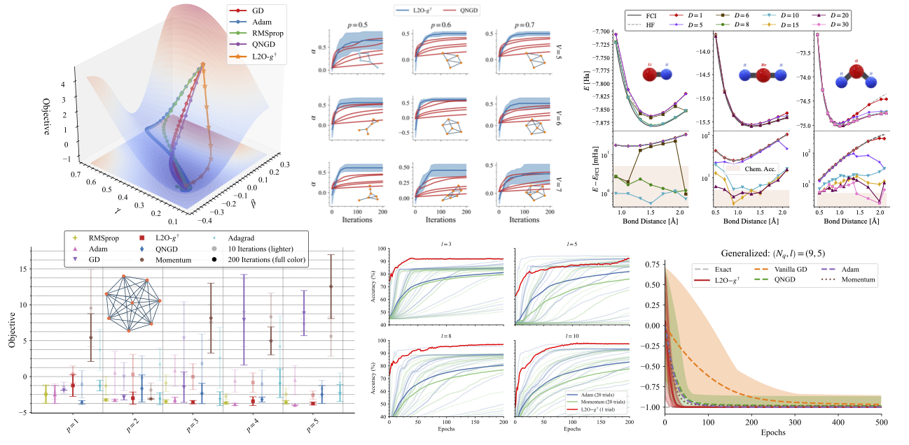

# L2O-$`g^\dagger`$: Learning to Optimize Parameterized Quantum Circuits with Fubini–Study Metric Tensor

[](https://arxiv.org/abs/2407.14761)


<br>
<p align="center">
  
</p>

## Introduction

This is the official repository of the paper ["_L2O-$`g^\dagger`$: Learning to Optimize Parameterized Quantum Circuits with Fubini–Study Metric Tensor_"](https://arxiv.org/abs/2407.14761).

Before the advent of fault-tolerant quantum computers, variational quantum algorithms (VQAs) play a crucial role in noisy intermediate-scale quantum (NISQ) machines. Conventionally, the optimization of VQAs predominantly relies on manually designed optimizers. However, learning to optimize (L2O) demonstrates impressive performance by training small neural networks to replace handcrafted optimizers. In our work, we propose L2O-$`g^\dagger`$, a quantum-aware learned optimizer that leverages the Fubini-Study metric tensor ($`g^\dagger`$) and long short-term memory networks. We theoretically derive the update equation inspired by the lookahead optimizer and incorporate the quantum geometry of the optimization landscape in the learned optimizer to balance fast convergence and generalization. Empirically, we conduct comprehensive experiments across a range of VQA problems. Our results demonstrate that L2O-$`g^\dagger`$ not only outperforms the current SOTA hand-designed optimizer without any hyperparameter tuning but also shows strong out-of-distribution generalization compared to previous L2O optimizers. We achieve this by training L2O-$`g^\dagger`$ on just a single generic PQC instance. Our novel quantum-aware learned optimizer, L2O-$`g^\dagger`$, presents an advancement in addressing the challenges of VQAs, making it a valuable tool in the NISQ era.


<div style="display: flex; align-items: center;">
<div style="flex: 1;">

## Installation
1. Create a new conda environment with Python 3.10:
    ```bash
    conda create --name [name] python=3.10
    ```

2.  Activate the newly created environment:
    ```bash
    conda activate [name]
    ```
3.  Install the required packages using pip:
    ```bash
    pip install -r requirements.txt
    ```

## WandB
To configure WandB, follow these steps:

1. Obtain your WandB API key from your WandB account.

2. Add the WandB API key to the file utils/wandb_api_key.txt:
    ```
    [Your WandB API Key]
    ```
3. When running use ```--record``` optition.


## Options

- `--train`: Default is `False`. Use `--train` to train the optimizer.
- `--verbose`: Default is `False`. Use `--verbose` for verbose output.
- `--data`: Default is `'VQE-H2'`. Use `--data` to specify the task.
- `--load_model`: Default is `'None'`. Use `--load_model` to specify the model name.
- `--checkpoints`: Default is `'./checkpoints/'`. Use `--checkpoints` to specify the location to store the model.
- `--seed`: Default is `0`. Use `--seed` to set the random seed.

### HPO Arguments

- `--preproc`: Default is `True`. Use `--preproc` to enable preprocessing.
- `--preproc_factor`: Default is `10`. Use `--preproc_factor` to set the preprocessing factor.
- `--hidden_sz`: Default is `30`. Use `--hidden_sz` to set the hidden size.
- `--lamb_a`: Default is `0.01`. Use `--lamb_a` to set lambda a.
- `--lamb_b`: Default is `0.01`. Use `--lamb_b` to set lambda b.
- `--lr`: Default is `0.001`. Use `--lr` to set the optimizer learning rate.
- `--ep`: Default is `20`. Use `--ep` to set the number of epochs for the trained optimizer.
- `--period`: Default is `5`. Use `--period` to set the number of periods for each epoch.
- `--itr`: Default is `200`. Use `--itr` to set the number of optimizer iterations.
- `--repeat`: Default is `10`. Use `--repeat` to set the number of experiment repetitions.
- `--n_tests`: Default is `100`. Use `--n_tests` to set the number of tests.

### GPU Arguments

- `--use_gpu`: Default is `False`. Use `--use_gpu` to enable GPU usage.
- `--gpu`: Default is `0`. Use `--gpu` to specify the GPU id.

### WandB Arguments

- `--record`: Default is `False`. Use `--record` to enable WandB recording.
- `--project`: Default is `'l2o-g'`. Use `--project` to specify the project name.

### VQE Problem Arguments

- `--H2_bond`: Default is `0.7`. Use `--H2_bond` to set the bond length for the VQE-H2 problem.
- `--molname`: Default is `'H2'`. Use `--molname` to specify the molecule name.
- `--bond_length`: Default is `0.7`. Use `--bond_length` to set the bond length for the VQE-UCSSD problem.
- `--charge`: Default is `0`. Use `--charge` to set the charge of the molecule.
- `--rale_layers`: Default is `1`. Use `--rale_layers` to set the number of layers in RALE.

### Rand_VC Problem Arguments

- `--VC_qubits`: Default is `4`. Use `--VC_qubits` to set the number of qubits in the random VC problem.
- `--VC_layers`: Default is `1`. Use `--VC_layers` to set the number of layers in the random VC problem.
- `--VC_seed`: Default is `0`. Use `--VC_seed` to set the seed for the random VC problem.
- `--VC_rand_ham`: Default is `False`. Use `--VC_rand_ham` to enable random Hamiltonian.

### Reupload Circuit Arguments

- `--RP_func_type`: Default is `'circle'`. Use `--RP_func_type` to specify the classifier function type.
- `--RP_qubits`: Default is `1`. Use `--RP_qubits` to set the number of qubits in the random VC problem.
- `--RP_layers`: Default is `3`. Use `--RP_layers` to set the number of layers in the random VC problem.
- `--RP_ndata`: Default is `5000`. Use `--RP_ndata` to set the total number of data points.
- `--RP_seed`: Default is `0`. Use `--RP_seed` to set the seed for the random VC problem.

- `--batch_size`: Default is `32`. Use `--batch_size` to set the batch size.

### QAOA MaxCut Arguments

- `--QAOA_n_nodes`: Default is `3`. Use `--QAOA_n_nodes` to set the number of nodes in QAOA MaxCut.
- `--QAOA_p_layers`: Default is `1`. Use `--QAOA_p_layers` to set the number of layers in QAOA MaxCut.
- `--QAOA_edge_prob`: Default is `0.5`. Use `--QAOA_edge_prob` to set the QAOA edge probability.
- `--QAOA_seed`: Default is `0`. Use `--QAOA_seed` to set the QAOA seed.

### Test Option

- `--save_path`: Default is `'results/'`. Use `--save_path` to specify the save path.
- `--save_traj`: Default is `False`. Use `--save_traj` to save the parameter trajectory.

### Ablation Option

- `--abl_cl`: Default is `False`. Use `--abl_cl` to enable ablation on CL.
- `--abl_g`: Default is `False`. Use `--abl_g` to enable ablation on g.


## Usage
To train the a new model use `--train` option.
An example is:

```bash
python main.py --train --data QAOA_MaxCut --verbose --QAOA_n_nodes 6 --QAOA_p_layers 4 --QAOA_edge_prob 0.7
```

If you want to use the trained model to optimize a new problem, here is an example:

```bash
python main.py --load_model [model_name] --data VQE-UCCSD --verbose --repeat 5 --molname BeH2 --bond_length 0.9 --itr 200
```

## Results / Checkpoints
When saving results, the output folder follows this format:

```
results/mod_[train_name]-[train_hash]set[problem_name]-[problem_hash]
```
- `[train_name]`: This is the name of the problem l2o-g is train on. For example, `QAOA_MaxCut`.
- `[train_hash]`: This is the hash of the problem configuration. For example, `0b785a1f`.
- `[problem_name]`: This is the name of the problem being tested. For example, `QAOA_MaxCut`.
- `[problem_hash]`: This is the hash of the problem configuration. For example, `0b785a1f`.


When saving model checkpoints, the folder follows this format:
```
checkpoints/[train_name]-[train_hash]
```

- `QAOA_MaxCut`: This is the name of the problem being trained.
- `d8ef508e`: This is the hash of the poeblem configuration.


## Implement New VQAs Problem
We want to make the implementation of new VQAs problem as easy as possible.
Follow these steps:

1. Add problem argument(s) in `main.py`. For example:

    ```python
    parser.add_argument('--new_arg', type=float, default=1.0, help='some description')
    ```

2. Add a new option for the problem in `utils/tool.py`. For example:

    ```python
    elif args.data == 'new_problem':
        print('Running Problem new_problem')
        problem = new_problem()
        dimension = 
        cost_func = problem.get_loss_function()
        metric_fn = problem.get_metric_fn()
        return dimension, cost_func, metric_fn
    ```

3. Add the new problem implementation in the `problems/new_problem.py`. And import into `utils/tool.py`.


## News

- [2024.07.23] :rocket: Our paper is now available on [arXiv](https://arxiv.org/abs/2407.14761).

<h2 id="citation">🔖 Citation</h2>

📚 If you find our work or this code to be useful in your own research, please kindly cite our paper :-)

```bibtex
@article{huang2024l2o,
  title={L2O-$ g\^{}$\{$$\backslash$dagger$\}$ $: Learning to Optimize Parameterized Quantum Circuits with Fubini-Study Metric Tensor},
  author={Huang, Yu-Chao and Goan, Hsi-Sheng},
  journal={arXiv preprint arXiv:2407.14761},
  year={2024}
}
```

<h2 id="authors">🖌️ Authors</h2>

[Yu-Chao Huang](https://physics-morris.github.io), [Hsi-Sheng Goan](https://www.phys.ntu.edu.tw/enphysics/goan.html).

<p align="center"></p>
